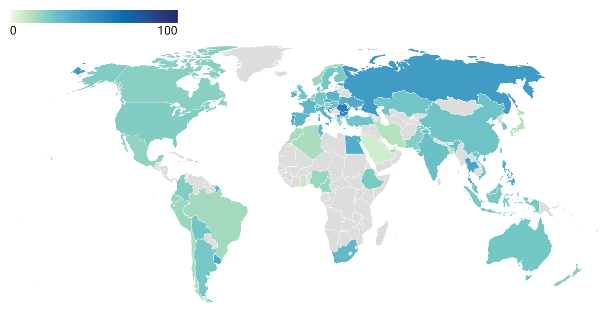
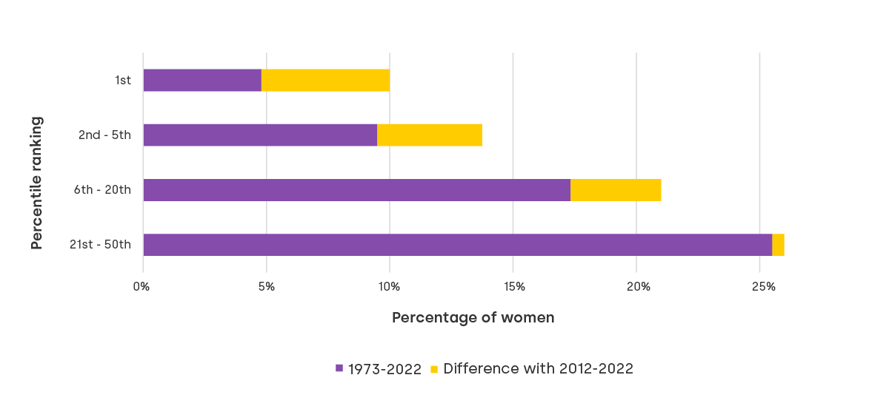

 **Women in Economics Paris and Saclay (WEPS)** is an initiative dedicated to evaluate, reflect on and improve the place of **women and gender minorities** in **Economics**. We do so by diffusing academic knowledge on gender imbalances, creating spaces to share experiences, and strengthening connections between women economists and economists from gender minorities. Join us in this important initiative to create a **more inclusive and diverse economics profession**.
{: .notice--accent}

**New:**  
📢 📣 **[Click here to see the summary of our last conference](https://weps-womeninecon.github.io/Webpage/event_may_16_2023/)** 📢 📣
{: .notice--danger}
 
 
### Why now? 
 
  * **Gender imbalances** are increasingly studied by economists. Institutions such as the [American Economic Association](https://www.aeaweb.org/about-aea/committees/cswep) have acknowledged the need to adress this issue within our discipline. **Local initiatives** as well as cross-country networks are burgeoning the positive evolution in the gender distrubution of economic scholars let us hope for progress. 

> However, gender differences persist and to the best of our knowledge, **there is no platform for female economists in Paris**. This is why it is important to undertake actions to **foster diversity in economics** and to adress gender differences. 

  * The issue of gender imbalance in economics is not new, but it has gained renewed attention in recent years. This attention is partly due to the growing recognition of the importance of diversity in academic fields, and the benefits it brings in terms of better research and a more inclusive academic environment. Additionally, the *#MeToo* movement has exposed the prevalence of sexual harassment and discrimination in academia, including economics.

### Contextual evidence

  <strong>Female representation in Economics by country (in %)</strong>
  
   
  <em> Source: Berland, O., Harman, O., & Moreau-Kastler, N. (2023). Pipelines or pyramids: A review of barriers for women in economics.</em>

  * **Economics is the social science discipline where women are least represented.** The lack of gender equality in economics is evident in the low representation of women in top academic positions. According to a report by the American Economic Association, women comprise only **15% of tenured economics professors in the US**, despite accounting for almost 50% of all economics PhDs awarded since the 1990s. 

> The situation is not any better **in Europe**, where a mere **12% of full professors of economics are women**. This gender imbalance is also reflected in the editorial boards of top economics journals, where women constitute less than 20% of members.

 <strong>Proportion of women in groups by ranking in publication by RePEc</strong>
     
  
   
  <em> Source:  Berland, O., Harman, O., & Moreau-Kastler, N. (2023). Pipelines or pyramids: A review of barriers for women in economics.</em> 

  * The reasons for this gender imbalance are multifaceted and complex. One factor is the persistent **gender biases** that exist in academic hiring and promotion processes. Furthermore, women in economics face the additional challenge of working in a **male-dominated field, which can lead to feelings of isolation and exclusion**.

### Some ressources

  - **WinE Bibliography on Research on Women in Economics** [https://www.eeassoc.org/committees/wine/bibliography](https://www.eeassoc.org/committees/wine/bibliography)
  - *"Women in Economics: Stalled Progress"* by the American Economic Association (AEA) [https://www.aeaweb.org/articles?id=10.1257/jep.33.1.3](https://www.aeaweb.org/articles?id=10.1257/jep.33.1.3)
  - Berland, O., Harman, O., & Moreau-Kastler, N. (2023). *Pipelines or pyramids: A review of barriers for women in economics.* IGC working paper.

🔔 **[Subscribe here](https://docs.google.com/forms/d/e/1FAIpQLSeGiRvHdq-_eL7PFWXI0oLYUMBkaFyGqTRAAOTwU-b3aM3PBg/viewform)** to the mailing list if you haven’t yet

 

